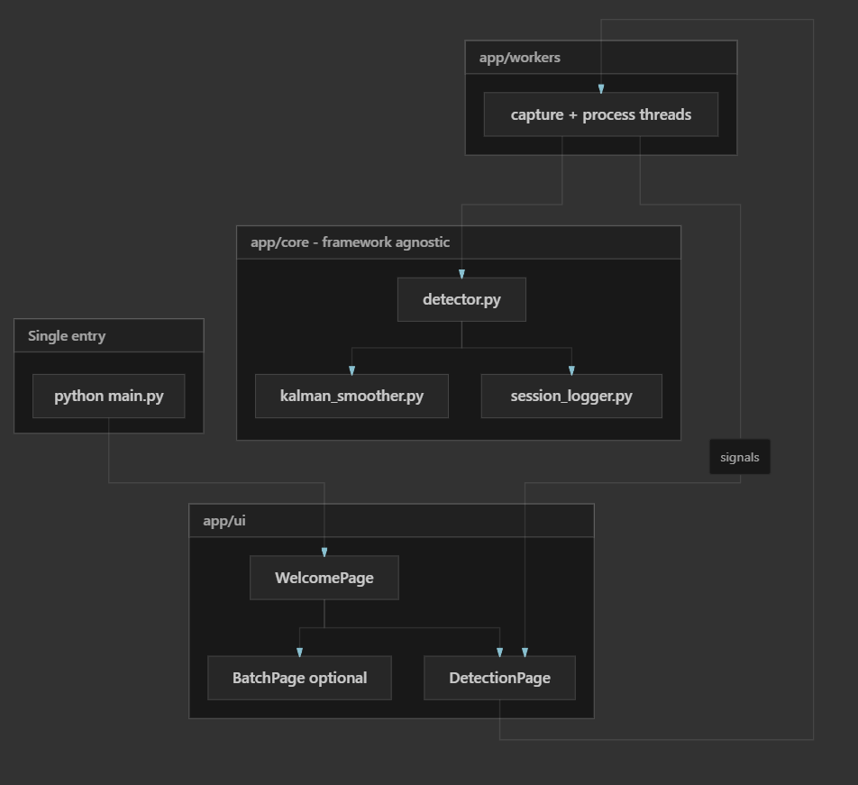
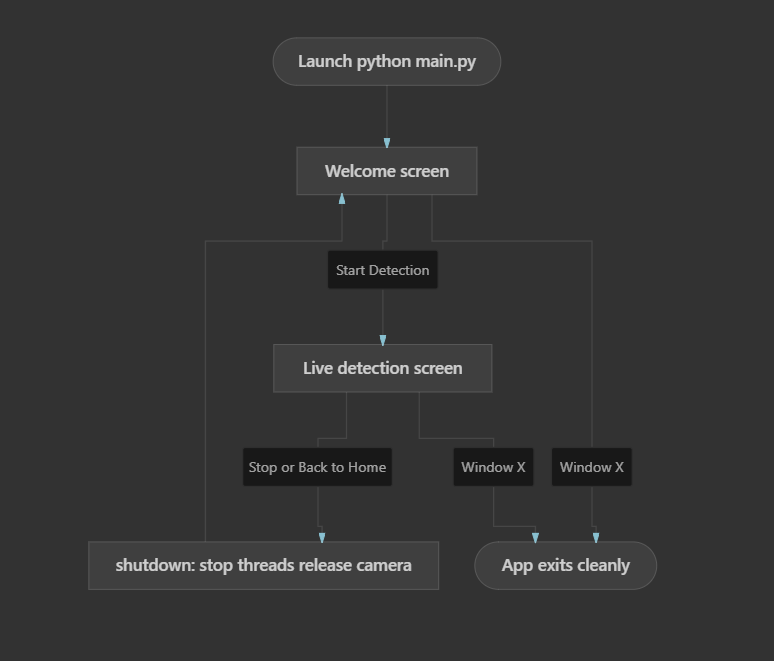
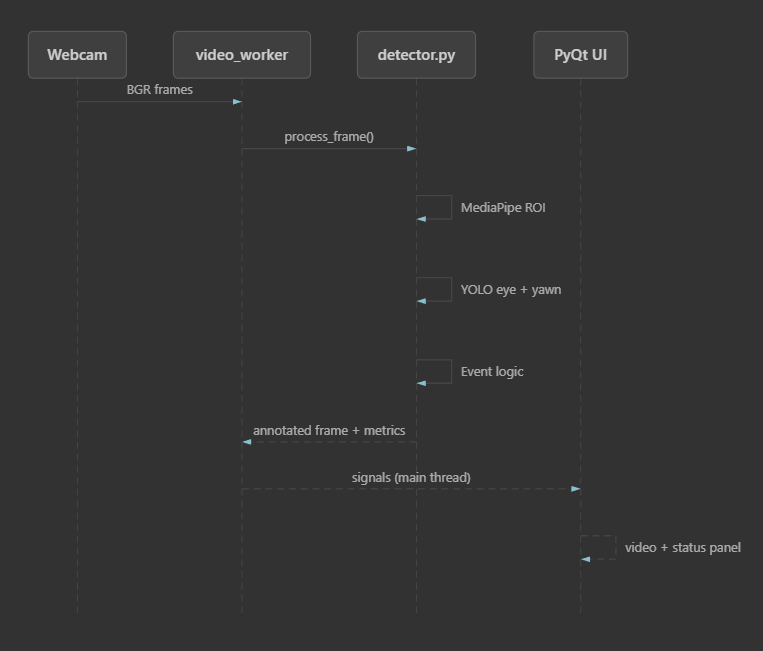

# Real-Time Drowsiness Driving Detection (Unified Upgrade)

[](https://github.com/Prince-213/real-time-drowsy-driving-detection)
[](https://github.com/DevMio23/real-time-drowsy-driving-detection)


Monitor driver alertness in real time using facial landmarks, dual YOLOv8 models (eyes + yawn), and a PyQt5 interface. This repository is an **active upgrade** of the upstream project, refactored for thesis work, reliability, and a single maintainable codebase.

| Repository | Role | Link |
|------------|------|------|
| **Upstream (original fork source)** | Baseline implementation, datasets, training notebooks | [Prince-213/real-time-drowsy-driving-detection](https://github.com/Prince-213/real-time-drowsy-driving-detection) |
| **This repository (your fork)** | Unified app, phased upgrades, documentation | [DevMio23/real-time-drowsy-driving-detection](https://github.com/DevMio23/real-time-drowsy-driving-detection) |
| **Original author README** | Full baseline docs (install, datasets, training) | [Upstream README.md](https://github.com/Prince-213/real-time-drowsy-driving-detection/blob/main/README.md) |

---

## Why this fork exists

The upstream repo ([Prince-213/real-time-drowsy-driving-detection](https://github.com/Prince-213/real-time-drowsy-driving-detection)) provides a strong computer-vision pipeline (MediaPipe, YOLOv8, PyQt5, data capture, and training notebooks). While using it for research and a thesis, several issues made a dedicated fork necessary:

| Problem (upstream) | Impact | Approach in this fork |
|--------------------|--------|------------------------|
| Two entry points (`main.py` and `DrowsinessDetector.py`) with duplicated logic | Fixes in one file did not apply to the other | **One** entry point: `python main.py` + modular `app/` package |
| Closing the app with **X** could leave threads running | Infinite terminal loop until the shell was killed | `shutdown()`, **Stop Detection**, `closeEvent`, thread-safe Qt signals |
| High CPU usage on modest laptops | Poor usability during long sessions | Planned Phase 1: FPS cap, inference stride, lighter MediaPipe |
| Blink events misclassified as yawns | Unreliable metrics for validation | Planned Phase 2: debouncing, ROI/threshold fixes, Kalman smoothing |
| No session logging / analytics | Hard to produce quantitative thesis results | Planned Phase 3: CSV logs + statistics panel |
| Alerts partially disabled | Reduced practical safety value | Planned Phase 4: audio, visual, alert history |
| No static project homepage | Hard for users vs developers to onboard | Planned Phase 6: `web/index.html` + in-app quick start |

This fork preserves the upstream **training pipeline** (`CaptureData.py`, `AutoLabelling.py`, notebooks, `runs/` weights) and focuses upgrades on the **real-time detection application** and documentation.

For the complete original feature list, dataset links, and training workflow, see the [upstream README](https://github.com/Prince-213/real-time-drowsy-driving-detection/blob/main/README.md).

---

## Upgrade and implementation plan

Work proceeds in **phases**. Each phase is implemented and **tested before the next phase starts**.
### Phase status

| Phase | Focus | Status |
|-------|--------|--------|
| **0** | Unify codebase, Welcome → Live UI, graceful shutdown, `app/` package | **Done** |
| **1** | CPU optimization (FPS cap, inference stride, lighter MediaPipe) | Planned |
| **2** | Detection accuracy (blink vs yawn, Kalman smoothing) | Planned |
| **3** | CSV session logging + statistics panel (thesis data) | Planned |
| **4** | Alerts: audio, visual, history, configurable thresholds | Planned |
| **5** | Batch video analysis (offline runs + reports) | Planned |
| **6** | Static homepage (`web/`) + aligned in-app quick start | Planned |

### Planned feature impact

| Feature | Purpose |
|---------|---------|
| Event logging & analytics | Timestamped CSV per session; trends for thesis validation |
| Kalman filter smoothing | Fewer false positives from jittery YOLO outputs |
| Alert system | Audio + on-frame warnings + alert history |
| Batch video mode | Test recorded footage; export summaries |
| Project homepage | User guide + technical deep-dive for contributors |

### Target architecture (after all phases)



### Current application flow (Phase 0 — implemented)



## Quick start (this fork)

Clone **this** repository (not the upstream URL from the original README):

```bash
git clone https://github.com/DevMio23/real-time-drowsy-driving-detection.git
cd real-time-drowsy-driving-detection
```

### Requirements

- Python 3.10+ recommended  
- Webcam  
- Windows/Linux (audio alerts in later phases use `winsound` on Windows)  
- Trained weights under `runs/detecteye/` and `runs/detectyawn/` (included in repo)

### Install

```bash
python -m venv .venv

# Windows
.venv\Scripts\activate

# Linux / macOS
source .venv/bin/activate

pip install -r requirements.txt
```

### Run the unified application

```bash
python main.py
```

| Step | Action |
|------|--------|
| 1 | Welcome screen opens |
| 2 | Click **Start Detection** |
| 3 | Allow camera access; live feed and metrics appear |
| 4 | Click **Stop Detection** or **Back to Home** before closing |
| 5 | Close the window with **X** when finished |

**Deprecated (compatibility only):**

```bash
python DrowsinessDetector.py
```

This prints a notice and launches the same unified app via `main.py`.

### Camera not opening?

Edit [`app/config.py`](app/config.py) and set `CAMERA_INDEX` to `0` or `1` depending on your machine.

## Project structure (this fork)

```text
real-time-drowsy-driving-detection/
├── main.py                 # Single entry point — run this
├── app/
│   ├── config.py           # Paths, thresholds, camera index
│   ├── core/
│   │   └── detector.py     # MediaPipe + YOLO + event logic (no Qt)
│   ├── workers/
│   │   └── video_worker.py # Capture/process threads + Qt signals
│   └── ui/
│       ├── main_window.py
│       ├── welcome_page.py
│       ├── detection_page.py
│       └── styles.py
├── DrowsinessDetector.py   # Deprecated shim → main.py
├── runs/                   # YOLO weights (eye + yawn)
├── CaptureData.py          # Data collection (from upstream)
├── AutoLabelling.py        # GroundingDINO labeling (from upstream)
├── train.ipynb             # Model training (from upstream)
├── requirements.txt        # List of python library requirements
└── README.md
```

---

## Features

### Available now (Phase 0)

- **Unified PyQt5 app** with Welcome and Live detection screens  
- **Lazy camera start** — webcam only after **Start Detection**  
- **Graceful shutdown** — Stop, Back, and window close release threads and camera  
- **Thread-safe UI** — frames and metrics via Qt signals  
- **Dual YOLOv8 models** + MediaPipe landmarks (same ML stack as upstream)  
- **Real-time status panel** — blinks, eye closure, yawn duration, alert states  

### Planned (Phases 1–6)

See [Upgrade and implementation plan](#upgrade-and-implementation-plan) above.

### From upstream (unchanged tooling)

- **Data capture** — `CaptureData.py`  
- **Auto labeling** — `AutoLabelling.py` (GroundingDINO)  
- **Training** — `train.ipynb`, `LoadData.ipynb`, `RedirectData.ipynb`  

---

## How it works

The pipeline matches the upstream design; this fork reorganizes **runtime** code into `app/`:



### Models

| Model | Task | Classes | Weights path |
|-------|------|---------|----------------|
| Eye YOLOv8 | Open vs closed eye | `open eye`, `close eye` | `runs/detecteye/train/weights/best.pt` |
| Yawn YOLOv8 | Yawn vs no yawn | yawn / no yawn | `runs/detectyawn/train/weights/best.pt` |

**Training data (upstream):**

1. **Eyes** — [Eyes Dataset](https://www.kaggle.com/datasets/charunisa/eyes-dataset/code), [MRL Eye Dataset](https://www.kaggle.com/datasets/tauilabdelilah/mrl-eye-dataset)  
2. **Yawn** — [Yawning Dataset](https://www.kaggle.com/datasets/deepankarvarma/yawning-dataset-classification?select=yawn)  

**Auto labeling:** GroundingDINO (see upstream README and `AutoLabelling.py`).

> **Note:** Uploaded weights are preliminary and not fully converged (per upstream). This fork improves **application logic and UX**; retraining remains optional for higher accuracy.

---

## Technologies

| Technology | Use |
|------------|-----|
| Python | Application and training scripts |
| YOLOv8 (Ultralytics) | Eye and yawn detection |
| OpenCV | Camera capture and image ops |
| MediaPipe Face Mesh | Facial landmarks / ROIs |
| PyQt5 | Desktop UI |
| GroundingDINO | Auto-labeling (training pipeline) |
| Jupyter | Dataset prep and training notebooks |

---

## Contributing

1. Fork [DevMio23/real-time-drowsy-driving-detection](https://github.com/DevMio23/real-time-drowsy-driving-detection)  
2. Create a branch for your phase or fix  
3. Follow the phased plan; avoid duplicating entry points  
4. Open a pull request with what was tested  

Issues and feedback are welcome, especially on Phase 0 checklist items before Phase 1 begins.

---

## Acknowledgements

- **Upstream repository:** [Prince-213/real-time-drowsy-driving-detection](https://github.com/Prince-213/real-time-drowsy-driving-detection)  
- **Original project author (upstream README):** Eng. Tyrone Eduardo Rodriguez Motato — Computer Vision Engineer, Guayaquil, Ecuador — tyrerodr@hotmail.com  
- **This fork:** Maintained by [DevMio23](https://github.com/DevMio23) as *Unified Drowsiness Detection Upgrade* for research, thesis validation, and improved real-world usability  

If you use the baseline methods or datasets from the upstream project, please credit the [original README](https://github.com/Prince-213/real-time-drowsy-driving-detection/blob/main/README.md) and its author accordingly.

---

## License and disclaimer

This software is for research and educational driver-monitoring demonstrations. It is **not** a certified safety device. Always use proper rest breaks and follow road safety regulations. Model predictions can be inaccurate; do not rely on this app as the sole drowsiness countermeasure.
